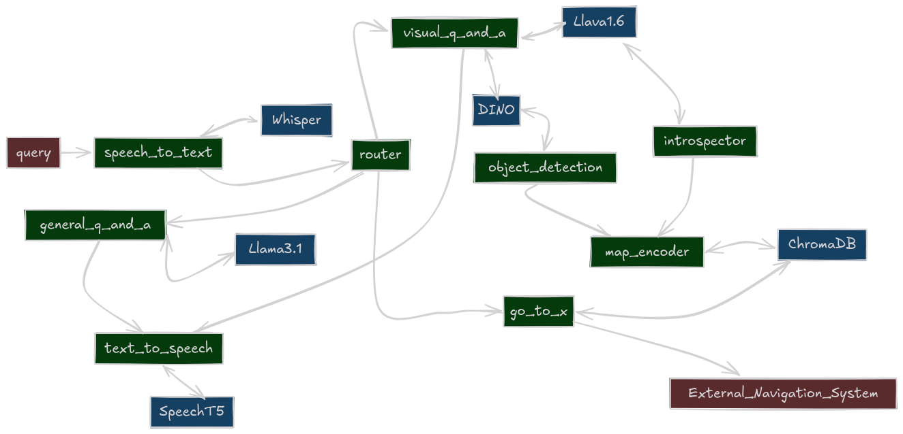

<picture>
  <source media="(prefers-color-scheme: dark)" srcset="docs/_static/ROS_AGENTS.png">
  <source media="(prefers-color-scheme: light)" srcset="docs/_static/ROS_AGENTS_DARK.png">
  
</picture>

ROS Agents is a fully-loaded framework for creating interactive embodied agents that can understand, remember, and act upon contextual information from their environment.

- **Agents in the real world:** Designed to be used with autonomous robot systems that operate in dynamic environments, specifically AMRs.
- **Intuitive API**: Simple pythonic API to utilize local or cloud based ML models (specifically **Multimodal LLMs** and other **Transformer Architectures**) on robots.
- **Semantic Memory**: Integrates vector databases, semantic routing and other supporting components to quickly build arbitrarily complex graphs for agentic information flow. No need to utilize bloated "GenAI" frameworks on your robot.
- **Made in ROS2**: Utilizes ROS2 as the underlying middleware. Theoretically, all devices that provide a ROS2 package can be utilized to send data to ML models, as long as the datatype callback has been implemented.

Checkout [Installation Instructions](https://automatika-robotics.github.io/ros-agents/installation.html) 🛠️

Get started with the [Quickstart Guide](https://automatika-robotics.github.io/ros-agents/quickstart.html) 🚀

Get familiar with [Basic Concepts](https://automatika-robotics.github.io/ros-agents/basics.html) 📚

Dive right in with [Examples](https://automatika-robotics.github.io/ros-agents/examples/index.html) ✨

## Installation 🛠️

### Pre-Requisits

#### Install ROS

ROS Agents is built to be used with ROS2. All ROS distributions starting from _Iron_ are supported. Install ROS2 by following the instructions on the [official site](https://docs.ros.org/en/iron/Installation.html).

#### Install a model serving platform

The core of ROS Agents is agnostic to model serving platforms. It currently supports [Ollama](https://ollama.com) and [RoboML](https://github.com/automatika-robotics/robo-ml). Please install either of these by following the instructions provided by respective projects. Support for new platforms will be continuously added. If you would like to support a particular platform, please open an issue/PR.

### Install ROS Agents (Ubuntu)

**Binary packages for Ubuntu will be released soon. Check this space.**

### Install ROS Agents from source

#### Get Dependencies

Install python dependencies

```shell
pip install pillow numpy opencv-python-headless 'attrs>=23.2.0' jinja2 httpx setproctitle msgpack msgpack-numpy numpy-quaternion
```

Download ROS Sugar

```shell
git clone https://github.com/automatika-robotics/ros-sugar
```

#### Install ROS Agents

```shell
git clone https://github.com/automatika-robotics/ros-agents.git
cd ..
colcon build
source install/setup.bash
python your_script.py
```

## Quick Start 🚀

Unlike other ROS package, ROS Agents provides a pure pythonic way of describing the node graph using [ROS Sugar](https://www.github.com/automatika-robotics/ros-sugar). Copy the following code in a python script and run it.

```python
from agents.clients.ollama import OllamaClient
from agents.components import MLLM
from agents.models import Llava
from agents.ros import Topic, Launcher

# Define input and output topics (pay attention to msg_type)
text0 = Topic(name="text0", msg_type="String")
image0 = Topic(name="image_raw", msg_type="Image")
text1 = Topic(name="text1", msg_type="String")

# Define a model client (working with Ollama in this case)
llava = Llava(name="llava")
llava_client = OllamaClient(llava)

# Define an MLLM component (A component represents a node with a particular functionality)
mllm = MLLM(
    inputs=[text0, image0],
    outputs=[text1],
    model_client=llava_client,
    trigger=[text0],
    component_name="vqa"
)
# Additional prompt settings
mllm.set_topic_prompt(text0, template="""You are an amazing and funny robot.
    Answer the following about this image: {{ text0 }}"""
)
# Launch the component
launcher = Launcher()
launcher.add_pkg(components=[mllm])
launcher.bringup()
```

And just like that we have an agent that can answer questions like **'What do you see?'**. To interact with this agent, ROS Agents includes a tiny web client. Checkout the [Quick Start Guide](https://automatika-robotics.github.io/ros-agents/quickstart.html) to learn more about how components and models work together.

## Elaborate Embodied Agents
The quickstart example above is just an amuse-bouche of what is possible with ROS Agents. In ROS Agents we can create arbitrarily sophisticated component graphs. And furthermore our system can be configured to even change or reconfigure itself based on events internal or external to the system. Check out the code for the following agent [here](https://automatika-robotics.github.io/ros-agents/examples/complete.html).

<picture>
  <source media="(prefers-color-scheme: dark)" srcset="docs/_static/complete_dark.png">
  <source media="(prefers-color-scheme: light)" srcset="docs/_static/complete_light.png">
  
</picture>

## Copyright

The code in this distribution is Copyright (c) 2024 Automatika Robotics unless explicitly indicated otherwise.

ROS Agents is made available under the MIT license. Details can be found in the [LICENSE](LICENSE) file.

## Contributions

ROS Agents has been developed in collaboration betweeen [Automatika Robotics](https://automatikarobotics.com/) and [Inria](https://inria.fr/). Contributions from the community are most welcome.
